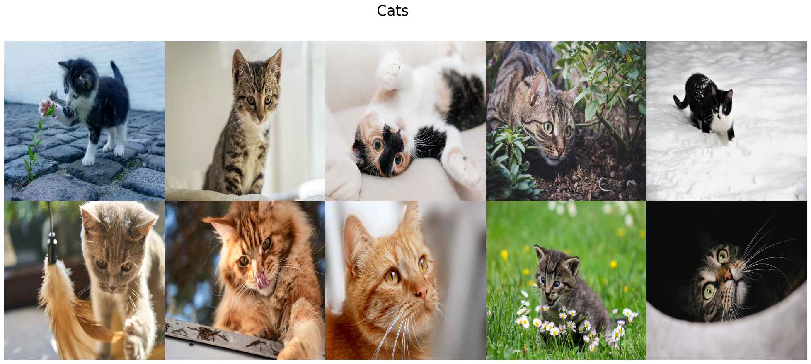
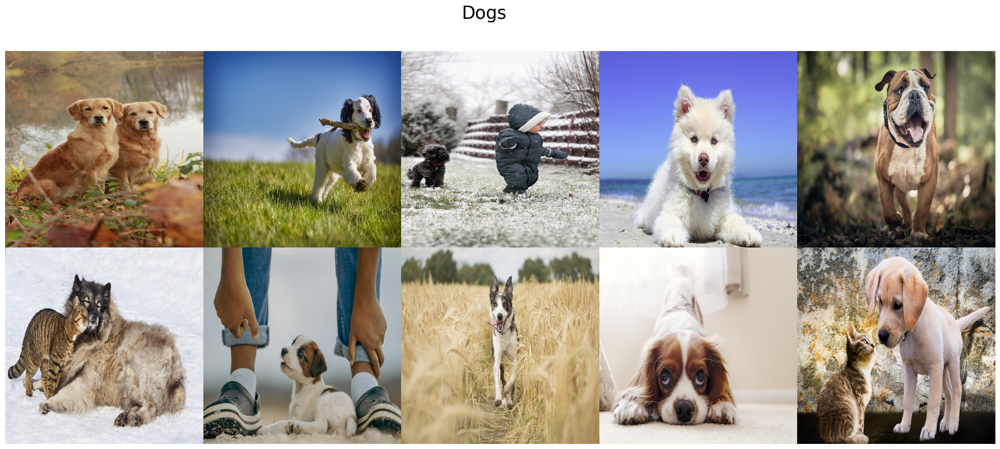
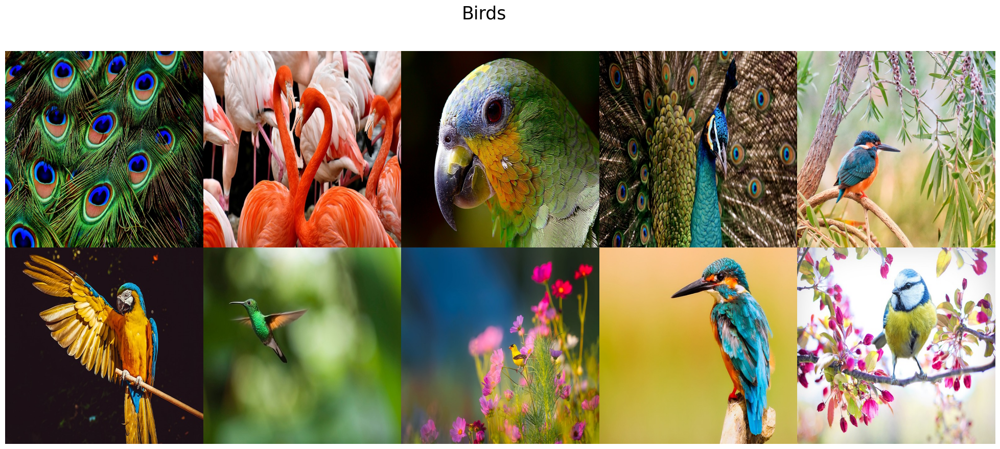
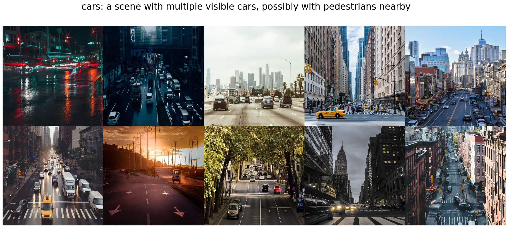
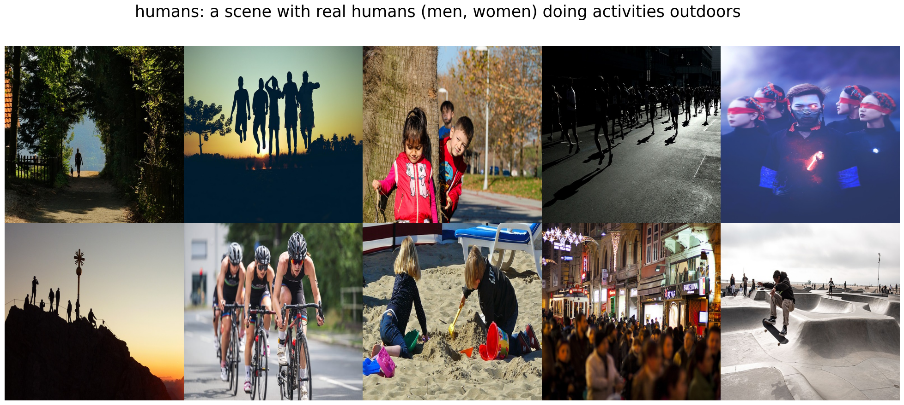
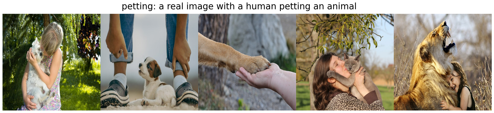
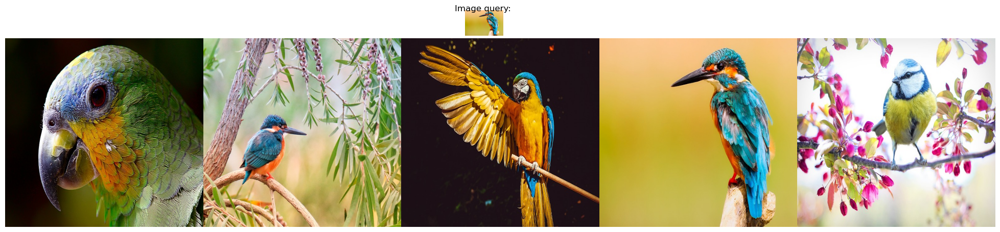
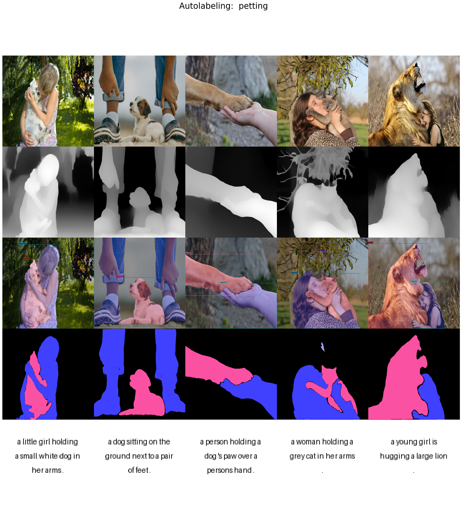
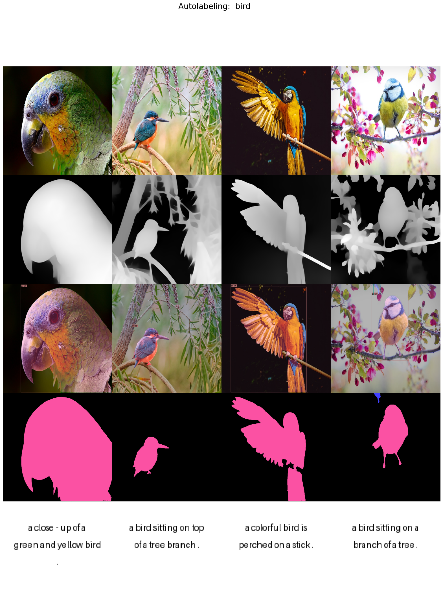

# Description

Experiments with CLIP based image search for dataset creation and foundational models for image autolabeling

# Setup and usage

```bash
cd ./dataset_creator/
# create conda environment
conda env create -f environment.yml
# install this pkg
pip install -e .
```

```bash
# then it should be possible to run existing scripts
python scripts/download_data.py
python scripts/select_dataset.py
python scripts/autolabel_dataset.py
```

# Results

<details><summary> Data Lake </summary>

- ```python scripts/download_data.py```

- Total images:






</details>

<details><summary> Data Selection </summary>

- ```python scripts/select_dataset.py```

- Rough Inference Times (RTX 3070 laptop):
  - CLIP img/text embedding: ~0.06s / it (~15it/s)

- Selected images:






</details>

<details><summary> Autolabeling </summary>

- ```python scripts/autolabel_dataset.py``` TODO:

- Rough Inference Times (RTX 3070 laptop):
  - DepthAnything: ~0.35s / it (~2.8it/s)
  - GroundingSAM:  ~17s   / it (scales ~linearly with instances to detect in `class_onthology`)
  - COCA:          ~1s    / it

- Autolabeled images:





</details>

<br>

# Ideas / TODOs

- [x] script to download files from internet (Pixabay API)
- [x] CLIP based image directory search
  - [x] image based search
  - [x] text based search
  - [x] similarity based filtering
- GT Autolabeling
  - [x] ImageCaptions                         (based on COCA model)
  - [x] BBox + InstanceSegmentation           (based on Grounding-Sam)
  - [x] Depth                                 (based on DepthAnything)

# References

- [CLIP: Learning Transferable Visual Models From Natural Language Supervision](https://arxiv.org/pdf/2103.00020.pdf)
- [CoCa: Contrastive Captioners are Image-Text Foundation Models](https://arxiv.org/pdf/2205.01917.pdf)
- [Grounding DINO: Marrying DINO with Grounded Pre-Training for Open-Set Object Detection](https://arxiv.org/pdf/2303.05499.pdf)
- [Grounded SAM: Assembling Open-World Models for Diverse Visual Tasks](https://arxiv.org/pdf/2401.14159.pdf)
- [Depth Anything: Unleashing the Power of Large-Scale Unlabeled Data](https://arxiv.org/pdf/2401.10891.pdf)

- <https://github.com/mlfoundations/open_clip>
- <https://github.com/IDEA-Research/Grounded-Segment-Anything>
- <https://github.com/LiheYoung/Depth-Anything>
- <https://github.com/autodistill/autodistill>

- <https://medium.com/red-buffer/diving-into-clip-by-creating-semantic-image-search-engines-834c8149de56>
