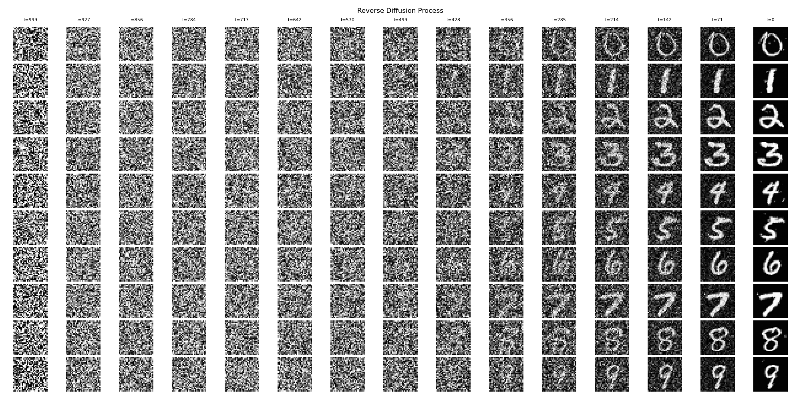

# Setup and usage

```bash
cd ./diffusion/
# create conda environment
conda env create -f environment.yml
# install this pkg
pip install -e .
```

```bash
# then it should be possible to run existing scripts with configs (hydra confs based)
python scripts/train.py --config-name "MNIST"
```

NOTE: check the `./config/` folder to see existing configs. Any param can also be overwritten from the cli.

# Results

<details><summary> Overfitting on small Image dataset </summary>

- Total images: 10
- 2 clases: my cat and my dog :smile:
- ```python scripts/train.py --config-name "ImageFolder_overfit"```

Forward Diffusion Examples:


Reverse Diffusion Examples:


</details>

<details><summary> MNIST </summary>

- ```python scripts/train.py --config-name "MNIST"```

Forward Diffusion Examples:


Reverse Diffusion Examples:



</details>

<details><summary> Cifar-10 </summary>

- ```python scripts/train.py --config-name "Cifar-10"```
- NOTE: results are not great yet, probably needs to be trained for way longer (e.g. 2000 epochs instead of 200)

Forward Diffusion Examples:


Reverse Diffusion Examples:


</details>

<details><summary> ShapeNet </summary>

- ```python scripts/train.py --config-name "ShapeNet"```
- NOTE: results are visualized as a 2D side projection and only trained with 5 easy to distinguish classes ("Airplane", "Car", "Chair", "Motorbike", "Pistol"). Probably would also have better results with more epochs.

Forward Diffusion Examples:


Reverse Diffusion Examples:


</details>

<br>
<br>

# Ideas / TODOs

- [x] add hydra conf
- [x] conditional or unconditional generation
- [x] add model EMA
- [x] calculate FID
- [x] add option to use custom folder with data (also util to overfit on the data from folder)
- [x] add generation of 2D/3D pointclouds
- [ ] generation with textual conditioning (e.g. CLIP based)
- [ ] generation with per/ pixel/point conditioning (e.g. based on semseg masks - from GT or SAM)

# Aknowledgments

Based on projects from:

- <https://learnopencv.com/denoising-diffusion-probabilistic-models/>
- <https://github.com/filipbasara0/simple-diffusion>
- <https://github.com/lucidrains/denoising-diffusion-pytorch>
- <https://github.com/hojonathanho/diffusion>
- <https://github.com/openai/improved-diffusion>
- <https://github.com/luost26/diffusion-point-cloud>
- <https://github.com/openai/point-e>
