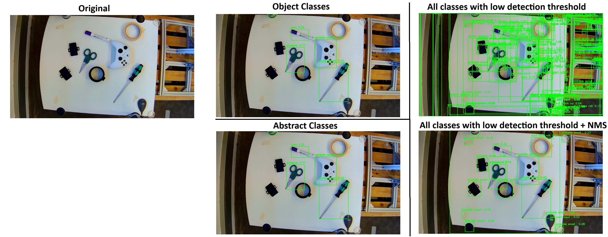
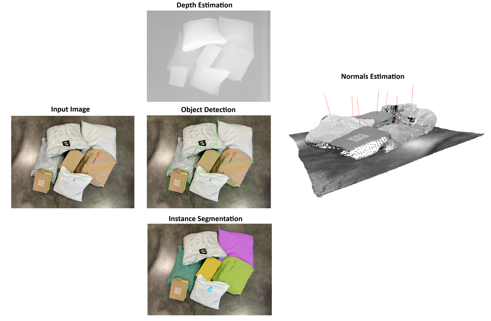

# Description

# Setup

```bash
cd ~/dev-playground/industrial_detection/
# create conda environment
conda env create -f environment.yml
# install pkg
pip install -e .
```

---

# Results

### Vision-Language Model (VLM) Object Detection

```bash
cd industrial_detection/
python industrial_detection/vlm_object_detection/main.py
```



Default chosen model ("google/owlv2-base-patch16-ensemble") can be run on a laptop (RTX3070) at a bit above 1Hz (0.9s) on GPU (<4Gb VRAM used). Inference on CPU possible but quite slower (~13s).

Uses SOTA VLM models freelly available on HuggingFace to detect objects of interest in the image from a prompt. Models tried:

- OwlV2: <https://arxiv.org/pdf/2306.09683> | <https://huggingface.co/docs/transformers/en/model_doc/owlv2>
- GroundingDino: <https://arxiv.org/pdf/2303.05499> | <https://huggingface.co/docs/transformers/en/model_doc/grounding-dino>

- Both OWL-ViT and Dyno use a mix of open-vocabulary, zero-shot learning, and feature embedding techniques to handle unseen objects, allowing them to detect unseen and open-set objects based on textual prompt without requiring explicit training.

Strategies tried:

  1) prompt the models to detect concrete objects of interest
  2) prompt the models to detect abstract object concepts ("objects which can be picked up", "small objects on the table")
  3) both approaches 1) and 2) with low detection threshold and then apply NMS to filter repeated detections

NOTE: Detections from all strategies could be improved by defining and area of interest and only keeping the detections inside that area (or defined constant zones to ignore)

---

### Picking Normals

```bash
cd industrial_detection/
python industrial_detection/picking_normals_angle/main.py
```



Method:

1) From the RGB input image extract the following features based on pretrained deep learning models:

    - Estimate Mono Depth (based on DepthAnythingV2: <https://arxiv.org/pdf/2406.09414> | <https://github.com/fabio-sim/Depth-Anything-ONNX/releases/>)

    - Detect Objects (based on OwlV2: <https://arxiv.org/pdf/2306.09683> | <https://huggingface.co/docs/transformers/en/model_doc/owlv2>)

    - Predict Instance segmentation masks (based on SAM2:  <https://arxiv.org/pdf/2408.00714> | <https://github.com/ibaiGorordo/ONNX-SAM2-Segment-Anything/releases>)
      - Uses Box2D centers detected from previous model as query points and return a mask of pixels associated with that detection

2) Take previous features and compute normals
    - Project depth image to 3D pointcloud (assuming a default pinhole camera model)
    - For each of the detected centers compute nearby object points (based on distance and segmentation mask for thta object)
    - Use RANSAC to fit the best plane for the surface points
    - Compute the 3D normal to the suface plane (pointing the camera)

Potential improvements:

- Tune params/queries for all models to reliably detect and segment correctly all boxes and surface estimation algorithm
- Improve runtime and VRAM requirements (~8Gb needed for all 3 DL models to fit on GPU)
- cleanup codebase

# References

- [Grounding DINO: Marrying DINO with Grounded Pre-Training for Open-Set Object Detection](https://arxiv.org/pdf/2303.05499)
- [Scaling Open-Vocabulary Object Detection](https://arxiv.org/pdf/2306.09683)
- [Depth Anything V2](https://arxiv.org/pdf/2406.09414)
- [SAM2: SegmentAnythinginImagesandVideos](https://arxiv.org/pdf/2408.00714)
