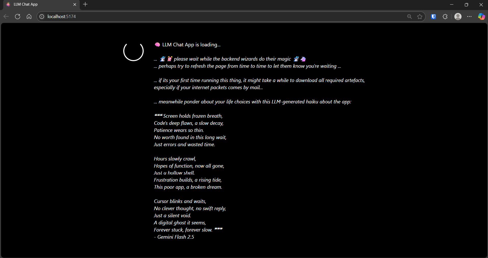
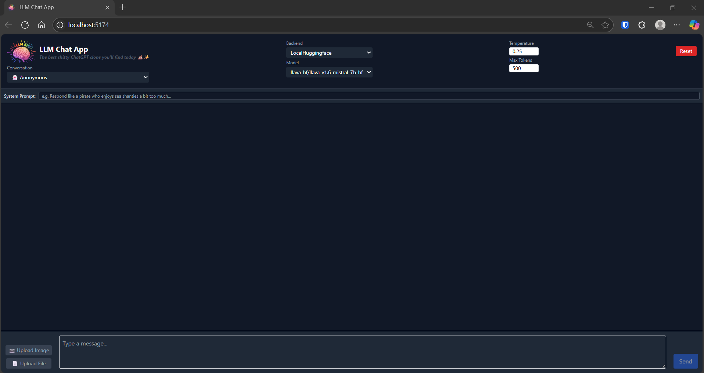
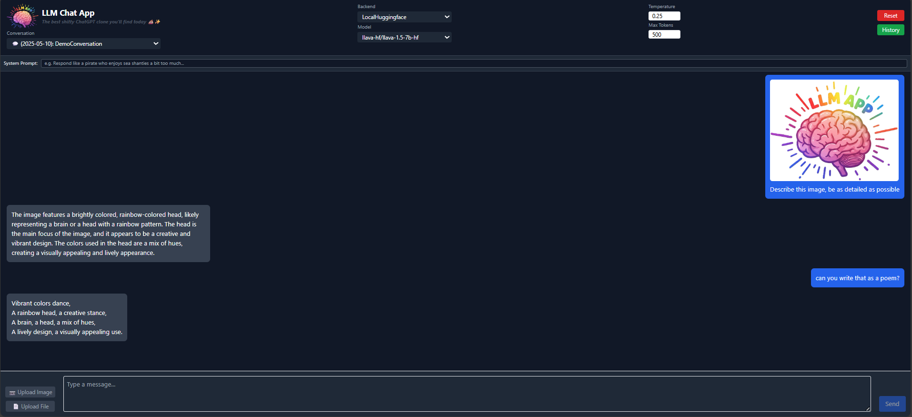
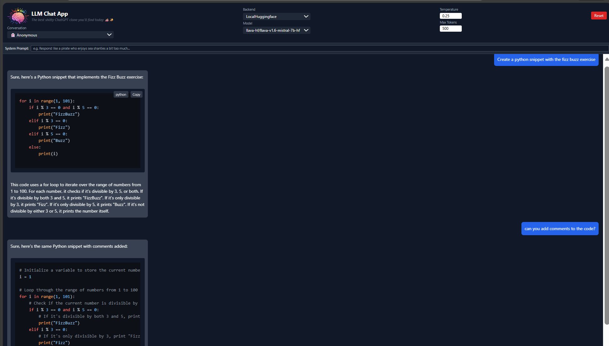
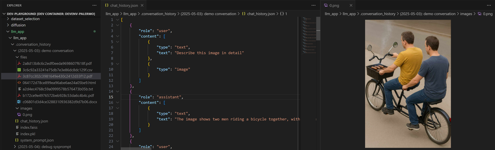

# Description

Creates a chat based LLM app, similar to what you would expect from ChatGPT or Gemini (but worse :D)

Features:

- Support for Local (HuggingFace) or Remote (OpenRouter API) backends
- Multiple models available for each Backend
- Text + Image input (local backend only)
- Document ingestion (.pdf, .txt, .docx, etc..) for Retrieval Augmented Generation (RAG) using Langchain + FAISS embeddings database
- LLM with chat history awareness
- Save/Load conversations or Anonymous chat
- System prompts to tune model output format
- Tune generation parameters (temperature, max tokens, etc..)
- Chat with code highlights
- "nice" frontend interface

---

## Results

<details>
<summary> Loading Screen </summary>



</details>

<details>
<summary> Clean UI </summary>



</details>

<details>
<summary> Text and Image inputs </summary>



</details>

<details>
<summary> Text and code </summary>



</details>

<details>
<summary> Backend database (history and RAG) </summary>



</details>

## Setup

```bash
cd ~/dev-playground/llm_app/
# create conda environment
conda env create -f environment.yml
# install backend pkgs
pip install -e .

# install frontend pkgs
cd ~/dev-playground/llm_app/llm_app/frontend
npm install
```

## Usage

Open 2 terminals, one to run the llm backend service and another to run the frontend

Run llm backend

```bash
# export OPENROUTER_API_KEY="<API_KEY>"   # NOTE: if you plan on using the OpenRouterAPI backend, then also export the API key:
conda activate env_llm_app
cd ~/dev-playground/llm_app/llm_app/backend
uvicorn main:app --host 0.0.0.0 --port 8000 --reload
# your backend should now be running on https://localhost:8000
# you can check the docs/swagger API on http://localhost:8000/docs
```

Run the frontend interface

```bash
cd ~/dev-playground/llm_app/llm_app/frontend
npm run dev
# your frontend should now be running on http://localhost:5174
```

## Ideas / TODOs

- [ ] Display in the frontend the sources used in RAG context

- [ ] Support WEB search
  - for each query search, first search the web and download the first n pages
  - store the pages with the RAG embeddings database
  - pass additional context from downloaded pages to the LLM
  - requires a first pass through the LLM to generate a good search test based on the prompt

- [ ] Support Speech to text to Speech model and support voice input/outputs
  - Change front-end to enable voice/audio inputs
  - add voice-to-text intermediate model
  - pass the text to the LLM to generate an output
  - optionally convert back the output to audio using text-to-voice model

- [ ] Real-time Streaming Responses using Websockets

- [ ] Create docker compose image to run both frontend and backend and deploy it somewhere
  - pretty annoying to make docker-compose run inside a docker dev env.. easier with just standalone env
